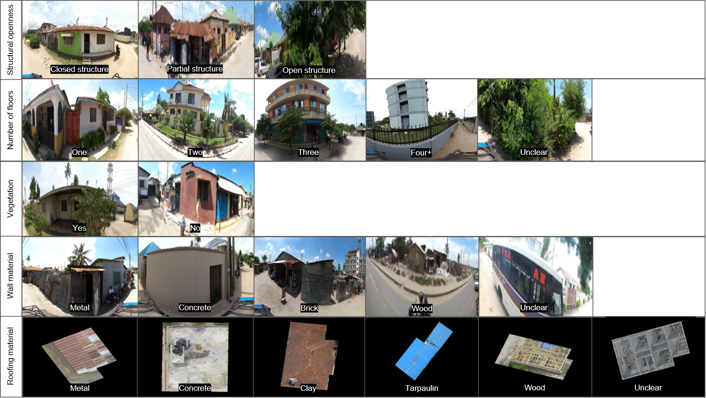

# Assessing Building Heat Resilience Using UAV and Street Imagery with Coupled Global Context Vision Transformers (CGCViT)

<!-- [] -->
[](LICENSE)
[](https://www.python.org)
[](https://doi.org/10.5281/zenodo.19886698)

End-to-end pipeline for classifying heat-relevant building attributes (rooftop material, wall material, structural openness, vegetation, floor count , etc ..) and regressing surface brightness from fused UAV and street-view imagery using a Coupled Global Context Vision Transformer (CGCViT).

---

## Abstract

Climate change is intensifying human heat exposure, particularly in densely built urban centers of the Global South. Low-cost construction materials and high thermal-mass surfaces further exacerbate this risk. Yet scalable methods for assessing such heat-relevant building attributes remain scarce. We propose a machine learning framework that fuses openly available unmanned aerial vehicle (UAV) and street-view (SV) imagery via a coupled global context vision transformer (CGCViT) to learn heat-relevant representations of urban structures. Thermal infrared (TIR) measurements from HotSat-1 are used to quantify the relationship between building attributes and heat-associated health risks. Our dual-modality cross-view learning approach outperforms the best single-modality models by up to 9.3%, demonstrating that UAV and SV imagery provide valuable complementary perspectives on urban structures. The presence of vegetation surrounding buildings (versus no vegetation), brighter roofing (versus darker roofing), and roofing made of concrete, clay, or wood (versus metal or tarpaulin) are all significantly associated with lower HotSat-1 TIR values. Deployed across the city of Dar es Salaam, Tanzania, the proposed framework illustrates how household-level inequalities in heat exposure—often linked to socio-economic disadvantage and reflected in building materials—can be identified and addressed using machine learning. Our results point to the critical role of localized, data-driven risk assessment in shaping climate adaptation strategies that deliver equitable outcomes.

---

## Repository Structure

```
config.py              Central path definitions and parameters
data/                  Raw input datasets (see data/readme.md)
output/                All generated artifacts (see output/readme.md)
preprocessing/         Numbered pipeline scripts (see preprocessing/readme.md)
training/              Model training scripts (see training/readme.md)
visualization/         Grad-CAM attention scripts (see visualization/readme.md)
```

---

## Prerequisites

| Category | Requirement |
|----------|-------------|
| Python | 3.10+ |
| GPU | Recommended for training (TensorFlow 2.10+) |
| Container | [Enroot](https://github.com/NVIDIA/enroot) (for CV model training) |
<!-- | GIS | [QGIS](https://qgis.org/) (for  inspection only) | -->

**External data sources:**

- [Geofabrik OSM extracts](https://download.geofabrik.de/africa/tanzania.html) — buildings and roads
- [OpenAerialMap](https://openaerialmap.org) — UAV orthomosaic
- [Mapillary](https://www.mapillary.com/)  — street-level panoramic imagery

---

## Setup

```bash
git clone https://github.com/GIScience/Assessing-Building-Heat-Resilience-Using-UAV-and-Street-Imagery-with-Coupled-Vision-Transformers.git
cd heat_cv
python -m venv venv
source venv/bin/activate   # Windows: venv\Scripts\activate
pip install -r requirements.txt
cp .env_template .env      # then add your MAPILLARY_ACCESS_TOKEN
```

---

## Required Inputs

| File | Description |
|------|-------------|
| `data/Msimbazi_image.tif` | UAV orthomosaic raster covering the AOI |
| `data/Msimbazi_extent.geojson` | AOI boundary polygon |
| `data/OSM_roads.gpkg` | Road geometries within the AOI |
| `data/OSM_residential_buildings.gpkg` | Residential building footprints within the AOI |
| `.env` | Must define `MAPILLARY_ACCESS_TOKEN` |
| `data/osm_labels.csv` | Manual building labels (required only for classification) |

To adapt the pipeline to a new study area, replace these files and update `config.py`.

---

## Pipeline Overview

### 1. Preprocessing

Run scripts sequentially from the project root:

```bash
python preprocessing/01_fetch_mapillary_data.py
python preprocessing/02_process_geospatial_data.py
python preprocessing/03_create_sat_data.py
python preprocessing/04_create_svi_data.py
python preprocessing/04b_generate_centerline_data.py
python preprocessing/05_fetch_and_engineer_features.py
python preprocessing/06a_generate_classification_data.py   # requires data/osm_labels.csv
python preprocessing/06b_generate_regression_data.py
```

Step 06a requires a manually curated `data/osm_labels.csv` (~2 000 labeled building–task pairs). See [preprocessing/readme.md](preprocessing/readme.md) for per-script I/O details and the label format specification.

### 2. Training

Set up the Enroot container once:

```bash
enroot import docker://tensorflow/tensorflow:2.10.1-gpu
enroot create --name pyxis_tensorflow tensorflow+tensorflow+2.10.1-gpu.sqsh
```

Launch training inside the container:

```bash
# Dual-input classifier (primary model)
enroot start --root --rw --mount "$HOME:/mnt/host" pyxis_tensorflow \
  sh -c "cd /mnt/host/heat_cv && python training/train_classifier_dual_input.py \
    --task material_rooftop --backbone Tiny --epochs 100 --batch_size 8 \
    --k_folds 5 --test_size 0.15 --augmentation_strength 0.3"

# Single-input classifier (ablation baseline)
enroot start --root --rw --mount "$HOME:/mnt/host" pyxis_tensorflow \
  sh -c "cd /mnt/host/heat_cv && python training/train_classifier_single_input.py \
    --task vegetation --input_type svi --backbone Tiny --epochs 100 --batch_size 8 \
    --k_folds 5 --test_size 0.15 --augmentation_strength 0.3"

# Dual-input regressor (brightness prediction)
enroot start --root --rw --mount "$HOME:/mnt/host" pyxis_tensorflow \
  sh -c "cd /mnt/host/heat_cv && python training/train_regressor_dual_input.py \
    --target_column wall_brightness --epochs 100 --batch_size 8 \
    --k_folds 5 --test_size 0.15 --augmentation_strength 0.3"
```

All outputs (checkpoints, metrics JSON, plots) are written to `output/training_results/<model_type>_<uuid>/`. See [training/readme.md](training/readme.md) for CLI arguments and checkpoint naming conventions.

### 3. Visualization

Generate Grad-CAM attention overlays from trained checkpoints:

```bash
python visualization/gradcam_dual_input.py \
  --weights_path output/training_results/.../material_rooftop_fold_1_best.h5 \
  --svi_path path/to/svi.jpg --uav_path path/to/uav.tif \
  --class_names concrete metal tarpaulin --output_name dual_rooftop_gradcam.png

python visualization/gradcam_single_input.py \
  --weights_path output/training_results/.../vegetation_svi_fold_1_best.h5 \
  --image_path path/to/image.jpg \
  --class_names yes no --output_name single_vegetation_gradcam.png
```

Outputs are saved to `output/visualizations/`. See [visualization/readme.md](visualization/readme.md).

---


## Classification Tasks

| Task key               | Description                         | Example labels                                      |
|----------------------|-------------------------------------|-----------------------------------------------------|
| `structural_openness` | Degree of structural enclosure      | closed structure, partial structure, open structure |
| `number_of_floors`    | Building storey count               | one, two, three, four+, unclear                     |
| `vegetation`          | Presence of surrounding vegetation  | yes, no                                             |
| `material_wall`       | Wall material                       | metal, concrete, brick, wood, unclear               |
| `material_rooftop`    | Roofing material                    | metal, concrete, clay, tarpaulin, wood, unclear     |




## License

MIT — see [LICENSE](LICENSE.txt).

